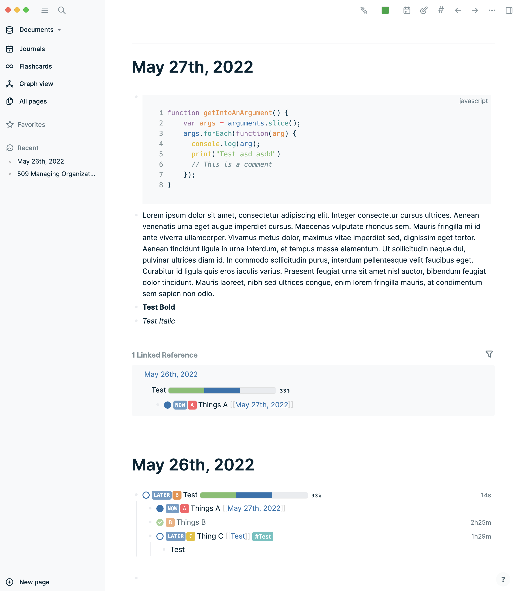
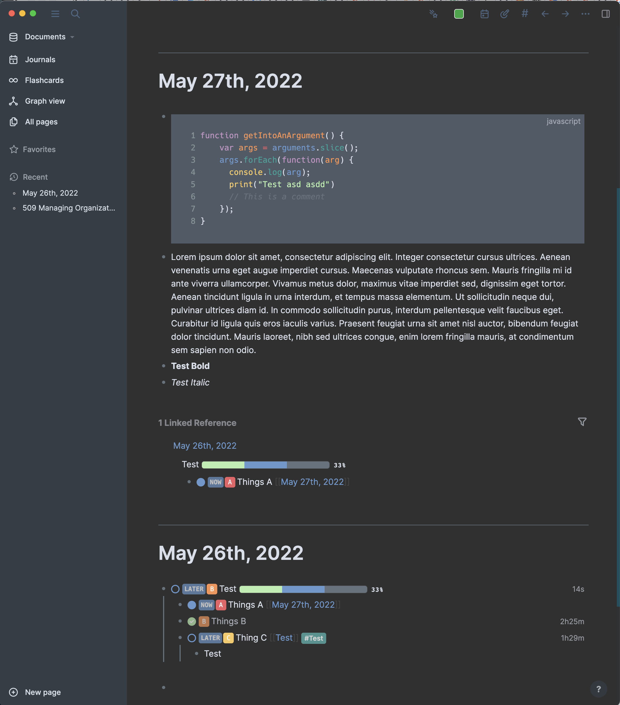

# logseq-ozean-theme

A logseq theme.

This theme is actively maintained and used on a daily basis by the author.

Features:

- Color pallet inspired by Oceanic Next
- Badge like markers and tags
- Font choice to optimize legibility

## Credits

Insparation and learnings how to make Logseq themes from:

- [logseq-dev-theme](https://github.com/pengx17/logseq-dev-theme)
- [logseq-bonofix-theme](https://github.com/Sansui233/logseq-bonofix-theme)

Fonts

- [Inter](https://fonts.google.com/specimen/Inter)
- [Hack](https://github.com/source-foundry/Hack)

## Screenshots

