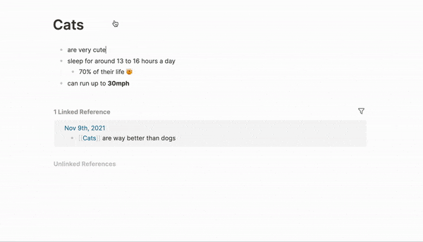

# Unsplash Image Plugin for Logseq

I've been enjoying Logseq more and more lately, but found myself missing some features from Notion, Framer, Figma, etc. The ability to quickly add a relevant image anywhere was one such feature.

This plugin adds `/unsplash` command to Logseq, and let's you search the entire Unsplash library of 3 Million+ images within a couple of keystrokes.

You can add them to your notes in one click, then resize them if you wish.

## Demo

## Installation

This plugin will hopefully be available in the Logseq store soon, once I've fixed a few quirks and run this by their devs. Installing it then will be as simple as clicking "Install" from the Plugins Marketplace in the Logseq app.

If you're adventurous and want to help refine this until then, see development instructions below.

## For development / local installation

1. clone this repo
2. `npm install && npm run build` in terminal to install dependencies.
3. `Load unpacked plugin` in Logseq Desktop client, and select the repo directory

## Someday / Maybe

-   [ ] Pagination
-   [ ] Infinite Scrolling
-   [ ] Option to store images locally
-   [ ] Keyboard navigation
-   [ ] Tags / Suggestions
