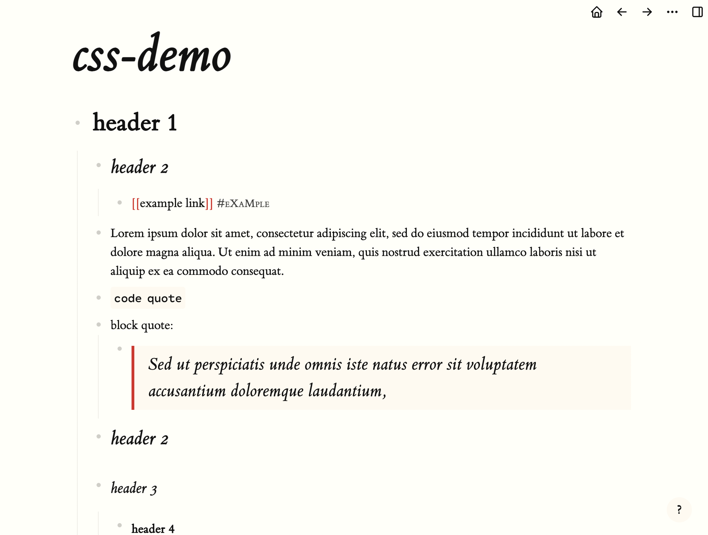

# Tufte theme
A port of the wonderful [Tufte CSS](https://edwardtufte.github.io/tufte-css/) framework to logseq.

Based on the layouts & typography of Edward's Tufte's influential books on displaying quantitative data. This approach focuses on careful use of spacing and font weight & style for communicating a hierarchy of information rather than colors or graphical delimiters.

Included is the beautiful et-book serif typeface from tufte-css which is used by default. There are non-technical reasons not to use Tufte's preferred sans serif, but by default this theme doesn't use sans at all. There is a reasonable set of sans fonts set to the `--sans` var if you want to switch. Monospace will be set in the wonderful [Cartograph CF](https://connary.com/cartograph.html) if you have it installed, otherwise MonoLisa or Fira Code or something farther down the stack.

I kept as much of the CSS as seemed reasonable, but removed the styles for margin- and side- notes. They don't fit extremely well with logseq's display model, and wouldn't provide much or any benefit. I also removed the (rather nice) link underline alternative, because it is complex and electron's default underline clears descenders, so the main benefit is unnecessary.

