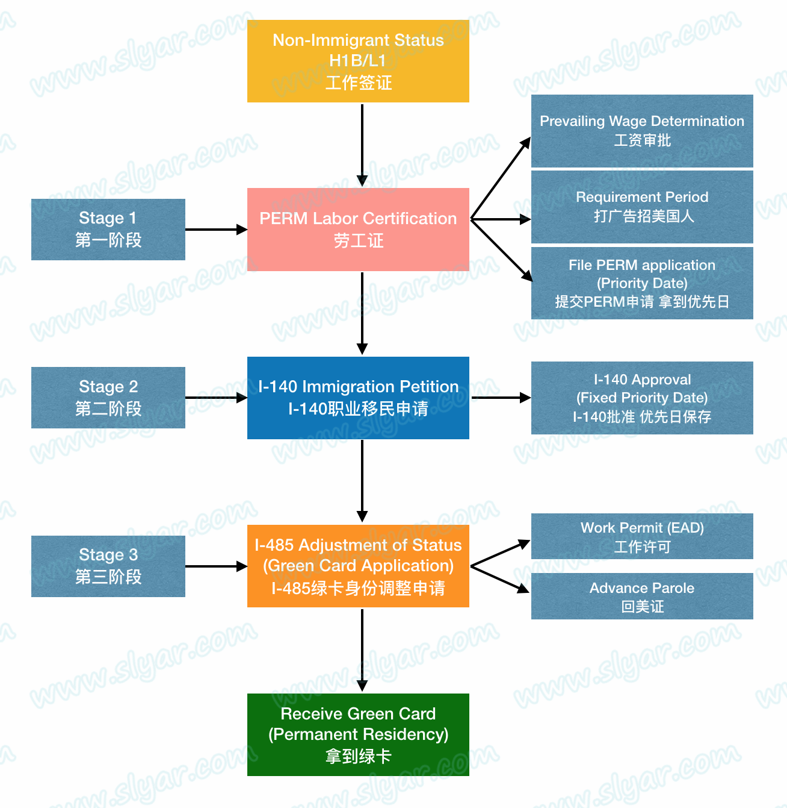

alias:: 移民

- ## US
  id:: 618784d8-f4a7-450f-9d93-8c53f56c03f3
	- {{embed [[L1 VISA]]}}
	- ## Steps
		- [How to Apply for a Green Card | USCIS](https://www.uscis.gov/green-card/how-to-apply-for-a-green-card)
		- 
		  [从工作签证(H1B)到绿卡(Green Card) - Slyar Home](http://www.slyar.com/blog/usa-from-h1b-visa-to-green-card.html)
		- ### PERM 劳工证
			- Program Electronic Review Management Process 证明美国公司需要雇佣你
		- ### I-140
			- PERM 通过后的 180 天有效期内要提交 I-140。证明资质
		- ### PD（Priority Date）
			- I-140 提交的日期。如果申请的是 EB2/3 的话，是 PERM 提交的日期
		- ### 排期
			- PD 之后按 [排期表](https://www.uscis.gov/green-card/green-card-processes-and-procedures/visa-availability-priority-dates/adjustment-of-status-filing-charts-from-the-visa-bulletin) 等待
		- ### I-485
			- 最后一步，排期到了之后提交 I-485。
			- 一般 485 提交后 90 天内可以获得 工作许可（EAD）和旅行文件（Advance Parole）
			- 485 提交后 180 天后，可以自由换工作
	- [美国新移民指南](https://www.uscis.gov/sites/default/files/document/guides/M-618_cs.pdf)
	- Transport
		- car
			- lease: rent a car and all the responsibility is charged by dealer
- ## Sweden
	- [Worth Moving to Sweden as Engineers?](https://hongchao.me/living-and-working-in-sweden-as-engineers/)