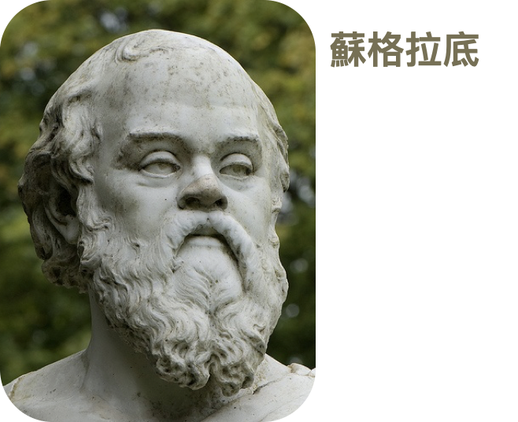

alias:: Socrates

- Socrates
- {width 300}
- 
- 徒弟 [[柏拉图]]
-
- 蘇格拉底的反詰法反對什麼？
	- 它反對傳統中的信念與偏見。
	  它反對權威中的盲從與欺騙。
	  它反對群眾中的情緒與反智。
	  它反對內心中的怯懦與冷漠。
- 蘇格拉底的反詰法有什麼用處？
	- 它可以，維持一個真正的民主，擁有自由的社會。
	  為什麼？
	  因為，我們所需要的民主制度，是一個有反思能力與審議機制的民主，不是一個由各種利益團體所組成的市場。
	  我們需要的民主是，真正能夠為公眾利益進行思考的民主。
	- 在這樣的民主機制中，我們才能夠產生出那種具有蘇格拉底理智能力的公民。
	  這種公民能夠對於他們的信念提出問題，質疑這些信念的真實性。
	  如果一個國家的國民將各種政論節目中所獲得的資訊，轉化成為投票的理由時，那麼這種對於他人言論深信不疑的態度，將無助於民主的發展。
	- 在這樣的民主機制中，我們才能夠產生出那種具有蘇格拉底理智能力的公民。
	  這種公民能夠對於他們的信念提出問題，質疑這些信念的真實性。
	  如果一個國家的國民將各種政論節目中所獲得的資訊，轉化成為投票的理由時，那麼這種對於他人言論深信不疑的態度，將無助於民主的發展。
	- 缺乏批判性思考的國家，即使擁有民主制度，國民只是各自表達信念，但缺乏真正的對話。
	  在這種情況中，好的論證不存在，而且偏見將很容易地誤認為是理性。
	  為了去除偏見以確保正義，我們需要論證的精神與力量，因為這是維護公民自由中最關鍵的工具。
- 蘇格拉底的「好樂迪」
	- 「好」：「個人主義」，是一種反外在認知的態度。
	  「樂」：「幸福主義」，是一種反有限發展的態度。
	  「迪」：「知識主義」，是一種反心理主義的態度。
	- （对比[[柏拉图]]的顶福启）
		- {{embed ((64b0b9ad-69ec-4d72-bd31-3b21acb216ae))}}
-