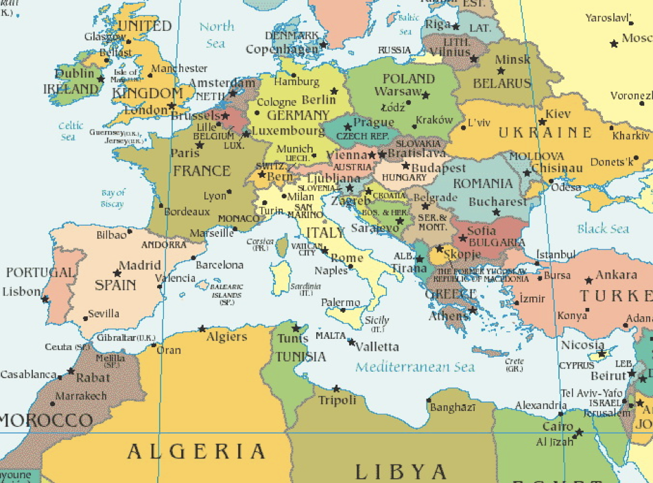

- by [[台湾大学]][[苑举正]]
- http://ocw.aca.ntu.edu.tw/ntu-ocw/ocw/cou/101S113/1 课程主页
- https://youtube.com/playlist?list=PLfS0WrMWEu_7Tl1dzP6D8m-RujAqLnQ8c 课程播放列表
- [101S113_AA01R01.doc](../assets/101S113_AA01R01_1689137536671_0.doc) 课程简介
- 第一课 [[古希腊哲学]]
	- 讲义
		- [101S113_AA01L01.pptx](../assets/101S113_AA01L01_1689137495217_0.pptx)
		- [101S113_AA02L01.pptx](../assets/101S113_AA02L01_1689137500603_0.pptx)
	- 希腊哲学起源：骑兵冲击平原建国，骑士人人平等
	- 
	- 言必及物 [[phonetic language]]
		- 对比中国传统哲学 多言无益
	- 希腊文 [[Phsis]] 是今天英文 [[Physics]] 的起源
	- 希腊哲学可以分为六派：
		- 1. 米勒司學派（[[Milesians]]）
		  2. 畢達哥拉斯學派（[[Pythagoreans]]）
		  3. 愛菲斯學派（[[Ephesians]]）
		  4. 伊利亞學派（[[Eleatics]]）
		  5. 多元學派（[[Pluralists]]）
		  6. 原子學派（[[Atomists]]）
- 第二课 [[Sophists]] 与 [[苏格拉底]]
	-
-
-